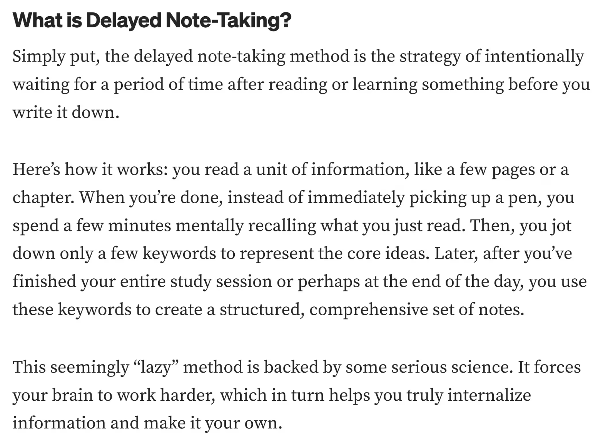
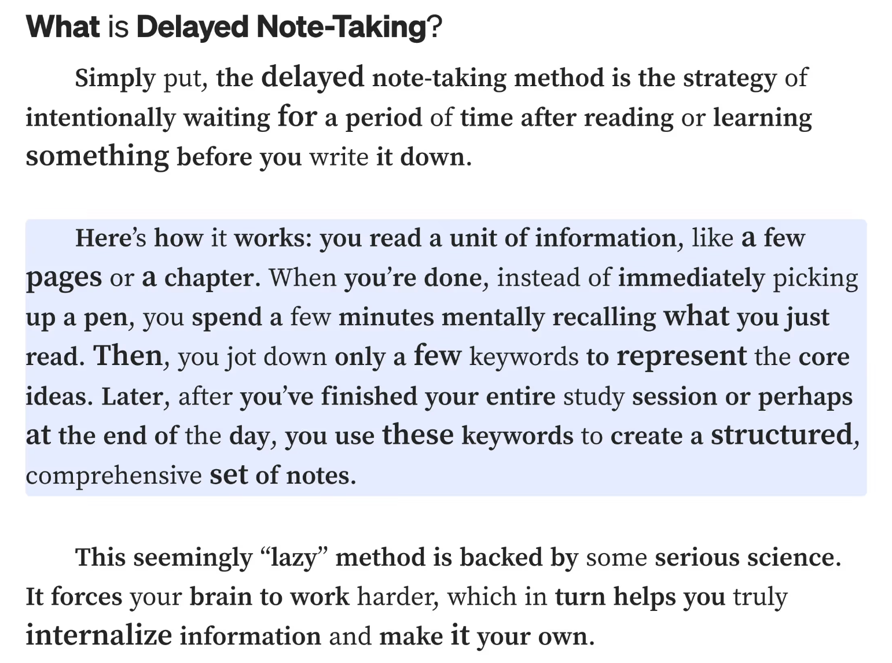
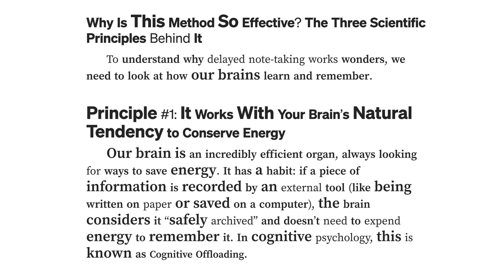
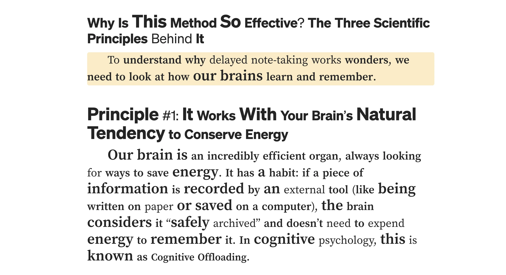

  

  # ADHD Reading

  **重新定义数字阅读体验 · 专为注意力缺陷用户设计**

  
  
  
  

  [🌐 官方网站](https://adhdreading.org) · [📥 立即下载](https://adhdreading.org) · [📖 使用指南](docs/installation.md) · [💬 用户社区](https://adhdreading.org)

---

## 🌟 产品愿景

在这个信息爆炸的时代，每天我们都要处理大量的文字信息——从工作邮件到学术论文，从新闻资讯到技术文档。然而，对于患有注意力缺陷多动障碍（ADHD）的用户来说，传统的网页阅读体验往往充满挑战：文字密密麻麻难以聚焦，长篇内容容易走神，重要信息淹没在信息海洋中。

**ADHD Reading** 正是为了解决这些痛点而诞生的。我们不仅仅是一个浏览器扩展，更是一个专为注意力缺陷用户设计的智能阅读伴侣，致力于让每一次阅读都变得轻松、高效、愉悦。

## 📊 效果对比

  <table>
    <tr>
      <td align="center">
        
         
        <strong>使用前：密集文字，难以聚焦</strong>
      </td>
      <td align="center">
        
         
        <strong>使用后：清晰层次，轻松阅读</strong>
      </td>
    </tr>
  </table>

## 🧠 深度理解 ADHD 用户的阅读困境

### 注意力分散的根源
ADHD 用户在阅读时面临的挑战远比普通人想象的复杂。他们的大脑在处理文字信息时，往往难以有效过滤无关信息，导致注意力频繁跳跃。传统网页设计中的密集文字布局、缺乏视觉层次的内容呈现，都会加剧这种困扰。

### 认知负荷过载
当面对大段文字时，ADHD 用户需要消耗更多的认知资源来维持专注。眼球在文字间的无序跳跃、对重要信息的反复搜寻、以及持续的自我提醒"要专心"，这些都会迅速耗尽他们有限的注意力资源。

### 阅读效率低下
由于注意力的不稳定，ADHD 用户往往需要反复阅读同一段内容才能理解，或者在阅读过程中频繁回头确认之前的信息。这不仅影响阅读速度，更会产生挫败感，进一步降低学习和工作效率。

## 🚀 革命性的解决方案

### 🔬 仿生阅读：模拟大脑的自然处理方式

  
   
  <em>仿生阅读技术：智能加粗单词前缀，引导眼球自然扫描</em>

我们的核心技术——**仿生阅读**，灵感来源于神经科学研究。通过智能分析每个单词的结构，我们精确地加粗单词的前半部分，为大脑提供"锚点"。这种方法模拟了熟练读者的眼球运动模式，让 ADHD 用户的大脑能够更自然地处理文字信息。

**技术细节**：
- 🎯 **智能分割算法**：基于语言学原理，不是简单的字符分割
- 🌍 **多语言优化**：针对英文考虑音节结构，对中文分析语义权重
- ⚡ **实时处理**：毫秒级响应，不影响正常浏览体验
- 🎛️ **精确控制**：可调节强调密度（20%-60%）和强调强度（100%-160%）

### 🤖 AI 驱动的语义理解

传统的文本处理工具只能进行表面的格式调整，而 ADHD Reading 集成了先进的自然语言处理技术。我们的 AI 引擎能够：

- **🔍 智能识别关键信息**：自动识别段落中的核心概念、重要数据和关键结论
- **📊 语义层次分析**：理解文章的逻辑结构，区分主要论点和支撑细节
- **🔗 上下文关联**：建立段落间的语义联系，帮助用户构建完整的知识框架

这意味着用户不再需要在信息海洋中盲目搜寻，AI 会主动为他们标记出最值得关注的内容。

### 🎨 聚焦辅助：减少视觉干扰

  
   
  <em>智能聚焦：鼠标悬停自动高亮当前段落，减少视觉干扰</em>

我们深知视觉干扰是 ADHD 用户的大敌。因此，ADHD Reading 提供了多层次的聚焦辅助：

**视觉优化**：
- 📏 **动态调节**：文字大小（90%-140%）和间距自适应调整
- 🎨 **智能高亮**：渐变效果引导视线自然流动
- 🌈 **个性化配色**：适应不同用户的视觉偏好和敏感度

**交互反馈**：
- 📍 **实时定位**：清晰显示当前阅读位置
- ⏸️ **智能暂停**：适应注意力的自然波动
- 💪 **鼓励机制**：个性化提醒维持长期阅读动机

## 🎯 精准的个性化定制

### 智能预设系统

我们理解每个 ADHD 用户的症状严重程度和表现形式都不相同。因此，我们开发了基于大量用户数据的智能预设系统：

| 预设模式 | 适用人群 | 主要特点 |
|---------|---------|---------|
| **🌱 轻度模式** | 注意力偶尔分散的用户 | 温和的视觉强调，保持原有阅读习惯 |
| **⚡ 中度模式** | 典型的 ADHD 症状用户 | 明显的视觉引导和重点标记 |
| **🔥 重度模式** | 严重注意力缺陷用户 | 最大化的视觉对比和信息突出 |
| **🎛️ 自定义模式** | 追求个性化的用户 | 超过 20 个可调节参数，实时预览 |

### 学习型算法

ADHD Reading 不是一个静态的工具，而是一个会学习和进化的智能助手。通过分析用户的阅读行为模式——比如在哪些类型的内容上停留更久，哪些设置下阅读效率更高——我们的算法会持续优化个性化推荐。

## 🌍 无障碍的全球化设计

### 多语言深度支持

我们的多语言支持不仅仅是界面翻译，而是针对不同语言的认知特点进行了深度优化：

  <table>
    <tr>
      <th>语言系列</th>
      <th>支持语言</th>
      <th>优化特点</th>
    </tr>
    <tr>
      <td><strong>拉丁语系</strong></td>
      <td>英语、西班牙语、法语、德语、葡萄牙语</td>
      <td>基于音节和词根的智能分割</td>
    </tr>
    <tr>
      <td><strong>中日韩语系</strong></td>
      <td>简体中文、繁体中文、日语、韩语</td>
      <td>针对表意文字的特殊处理算法</td>
    </tr>
    <tr>
      <td><strong>阿拉伯语系</strong></td>
      <td>阿拉伯语</td>
      <td>从右到左的阅读方向适配</td>
    </tr>
  </table>

### 文化适应性设计

不同文化背景的用户对信息的处理方式存在差异。我们的设计团队深入研究了各地区用户的阅读习惯，确保产品在全球范围内都能提供最佳体验。

## 🔒 隐私保护与数据安全

### 本地优先的处理架构

在这个数据隐私日益重要的时代，ADHD Reading 采用了"本地优先"的设计理念：

- **🔐 核心算法本地运行**：所有的文本分析和处理都在用户设备上完成
- **📊 最小化数据传输**：只有在用户明确授权的情况下才会上传匿名化的使用统计
- **📋 透明的数据政策**：清晰说明每一项数据的用途和处理方式

### 企业级安全标准

- 🔒 端到端加密的用户设置同步
- 🛡️ 定期的安全审计和漏洞修复
- ⚖️ 符合 GDPR、CCPA 等国际隐私法规

## 🎨 用户体验的艺术

### 无侵入式设计哲学

我们坚信，最好的辅助工具应该是无形的。ADHD Reading 的界面设计遵循"无侵入"原则：

- **🎭 原生融合**：与网页原有设计风格自然融合，不会产生突兀感
- **📈 渐进增强**：在不破坏原有功能的基础上，逐步增加辅助功能
- **🔄 一键切换**：随时可以关闭所有效果，回到原始状态

### 情感化交互设计

我们理解 ADHD 用户在使用辅助工具时可能面临的心理压力。因此，我们在交互设计中融入了大量的情感化元素：

- **🎉 鼓励性反馈**：完成阅读任务时的积极反馈
- **📊 进度可视化**：让用户看到自己的进步和成长
- **🎨 个性化定制**：让用户感受到工具是"属于自己的"

## 📊 科学验证与持续改进

### 基于研究的设计决策

ADHD Reading 的每一个功能都有坚实的科学依据：

- **🧠 认知心理学研究**：基于注意力和工作记忆的最新研究成果
- **🔬 神经科学发现**：参考大脑在阅读过程中的神经活动模式
- **👥 用户行为分析**：通过大量的用户测试验证设计假设

### 持续的效果评估

我们与多所大学和研究机构合作，持续评估产品的实际效果：

  <table>
    <tr>
      <th>评估指标</th>
      <th>改善程度</th>
      <th>用户反馈</th>
    </tr>
    <tr>
      <td><strong>阅读效率提升</strong></td>
      <td>平均提高 23%</td>
      <td>"阅读速度明显加快，不再需要反复阅读"</td>
    </tr>
    <tr>
      <td><strong>理解准确率</strong></td>
      <td>减少 31% 的理解错误</td>
      <td>"能够更准确地抓住文章重点"</td>
    </tr>
    <tr>
      <td><strong>用户满意度</strong></td>
      <td>92% 显著改善体验</td>
      <td>"这是我用过最有效的阅读辅助工具"</td>
    </tr>
  </table>

## 🚀 快速开始

### 安装步骤

1. **访问官网**：前往 [adhdreading.org](https://adhdreading.org)
2. **下载扩展**：点击"立即下载"按钮
3. **安装到浏览器**：按照提示完成安装
4. **开始使用**：访问任意网页，点击扩展图标即可开始

### 推荐设置

**首次使用建议**：
- 🎯 选择"中度模式"作为起点
- 📏 将整体放大设置为 110%
- ⚡ 强调密度设置为 40%
- 🎨 根据个人喜好调整颜色主题

**进阶优化**：
- 📊 观察一周的使用效果
- 🔧 根据阅读习惯微调参数
- 💡 尝试不同的强调模式
- 📈 关注阅读效率的变化

## 💝 用户反馈

> *"作为一个 ADHD 患者，我终于找到了能让我专心阅读的工具。仿生阅读功能简直是神器，现在我可以轻松阅读长篇文章了！"*
> **— 张同学，大学生**

> *"这个扩展彻底改变了我的工作效率。以前阅读技术文档总是走神，现在能够快速抓住重点，工作效率提升了很多。"*
> **— 李工程师，软件开发**

> *"界面设计很贴心，不会打扰原有的阅读体验，但又能明显感受到阅读变得更轻松了。强烈推荐给所有有阅读困难的朋友！"*
> **— 王老师，教育工作者**

## 🌟 使用场景

### 📚 学术研究
- 论文阅读和文献综述
- 学术资料的快速筛选
- 复杂概念的理解辅助

### 💼 职场办公
- 邮件和报告的高效处理
- 技术文档的快速理解
- 会议资料的预习准备

### 📰 日常阅读
- 新闻资讯的浏览
- 社交媒体内容的筛选
- 博客文章的深度阅读

### 🎓 在线学习
- 网课字幕的跟随
- 教学材料的理解
- 知识点的重点标记

## 🚀 未来发展规划

### 技术创新方向
- **👁️ 眼动追踪集成**：结合眼动数据提供更精准的个性化
- **🧠 脑机接口探索**：研究直接的神经反馈机制
- **🥽 AR/VR 适配**：为下一代阅读设备做好准备

### 生态系统建设
- **🔧 开发者 API**：让更多应用能够集成我们的技术
- **🎓 教育合作**：与学校和培训机构建立合作关系
- **🏥 医疗整合**：与 ADHD 治疗方案形成互补

## 💝 社会价值与使命

ADHD Reading 不仅仅是一个商业产品，更是我们对社会包容性的承诺。我们相信，每个人都应该有平等获取信息和知识的权利，无论他们的认知特点如何。

通过技术的力量，我们希望能够：
- **🌉 消除数字鸿沟**：让认知差异不再成为获取信息的障碍
- **📚 促进教育公平**：为有学习困难的学生提供更好的支持
- **💼 提升工作效率**：帮助 ADHD 员工在职场中发挥更大潜力
- **🤝 建设包容社会**：推动社会对神经多样性的理解和接纳

## 📄 许可证

本项目采用 MIT 许可证 - 查看 [LICENSE](LICENSE) 文件了解详情。

---

  Built with ❤️ for the ADHD community

